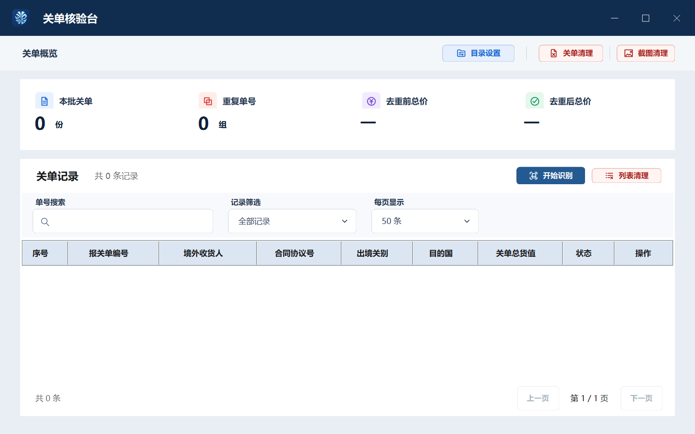

# 关单核验台

本地高频迭代请使用 [`docs/local-development-workflow.md`](docs/local-development-workflow.md) 中的单目录流程，避免每次修改重复复制 OCR 模型、.NET 运行时和完整解压包。

面向 Windows 10 / Windows 11 的本地关单识别、重复检查、逐币种去重合计与在线人工核验工具。支持完整解压后直接运行，不要求用户预装 .NET、Python、OCR 或数据库。



## 当前版本

v1.7.0：核验流程改为“自动填写单号 → 用户输入验证码并查询 → 自动检测稳定结果 → 自动保存长截图”，超时仍保留人工截图兜底。五个主操作按钮改用多分辨率扁平 PNG 图标，右键菜单精简为单一复制操作，关单总览重新建立“标题大于金额”的字号层级。修复 PDF 文字层把低位下划线集中到末尾时，`HNB_TX_US` 等结构化名称显示错位的问题。

便携版完整解压后双击根目录 `关单核验台.exe`。

## 功能

- 扫描指定文件夹当前层的 PDF、PNG、JPG/JPEG、BMP、TIF/TIFF，每批最多 200 个文件。
- 提取 6 个字段：报关单号、境外收货人、合同协议号、出境关别、目的国、关单总货值。
- PDF 文字层优先；扫描件和图片使用 Tesseract + RapidOCR/PP-OCRv5 双引擎，并逐字段交叉校验。
- 当前文件夹中相同报关单号全部置顶标红，去重合计只选一份规范记录。
- 多币种分别显示去重前/去重后金额，不进行汇率换算。
- 多币种总价在总览卡片中逐币种换行，避免窄窗口截断。
- 可把 PDF/图片直接拖入关单列表；软件会清空旧列表并识别拖入的新批次，不移动或删除源文件。
- 表格支持分页、搜索、状态筛选、双向调整列宽、横向滚动和选中单元格复制。
- “列表导出”位于“开始识别”和“列表清理”之间，导出本批全部记录为 Markdown；每份关单分别展示单号、收货人、合同协议号、逐项价格和逐币种总价，关单之间以横线分隔。分项校对迁移至导出文档，已移除“详情”功能。
- 导出表格完整保留长名称和协议号；冲突金额标记为未确认，不计入总价。无分项的旧记录提示重新识别。导出包括其他分页、搜索筛选隐藏的记录及重复文件。
- 在线校验自动采用 Windows 默认浏览器；默认浏览器不支持自动填写时，自动回退到 Edge/Chrome，不让用户选择。固定进入 `https://www.singlewindow.cn/#/publicInquiryDetail?id=pi4`，只填写正文“报关单号”栏。
- “开始识别”不访问网站；网站校验由用户逐条点击，用户输入验证码并查询后，软件自动检测结果并保存以报关单号命名的长截图，超时可手动截图。
- 列表、关单、截图三种清理互相独立；文件只处理当前层并移入 Windows 回收站。

## 设计思路

1. **本地优先**：关单内容、OCR 中间结果和历史状态留在本机；只有用户点击“校验”时才访问单一窗口网站。
2. **规则约束 OCR**：不把两个引擎的全文简单拼接，而是各自解析 6 个业务字段，再按号码长度、币制、版面标签、字段完整度和冲突类型裁决。
3. **保守处理冲突**：金额、单号、合同号数字等关键差异不猜测，保留记录并标记“需关注”。
4. **数据安全优先**：超过 200 个文件整批停止；破坏性文件操作两次确认、禁止磁盘根目录，并使用 Windows 回收站。
5. **桌面数据密度**：采用新版 Material 3 风格矢量规范和高 DPI 原生布局；宽屏展示全部字段，窄窗口提供省略提示与水平滚动，用户可双向调整任意列。

新版原始矢量稿、交互状态、设计令牌和实现说明保存在 `docs/design-handoff/customs-console-vector-handoff`，便于后续设备继续迭代。

更多说明见 [架构](docs/architecture.md)、[OCR 与去重方案](docs/ocr-pipeline.md)、[UI 与边界规则](docs/ui-and-boundaries.md)。

## 源码结构

```text
src/CustomsClearanceConsole/   .NET 8 WinForms 主程序
src/Launcher/                  根目录轻量启动器
scripts/                       开发依赖准备脚本
docs/                          架构、OCR、UI 与安全边界文档
third-party-notices/           第三方许可文本
```

## 开发构建

要求：Windows 10/11 x64、.NET 8 SDK。OCR 模型和原生运行库不重复提交到 Git，以避免仓库膨胀；可从已下载的便携发布包自动准备。

```powershell
.\scripts\bootstrap-from-release.ps1 -PackageRoot 'D:\Downloads\关单核验台-Windows-x64'
dotnet build .\src\CustomsClearanceConsole\CustomsClearanceConsole.csproj -c Release
```

准备脚本会从发布包的 `app` 与 `tools` 目录复制开发运行所需的 DLL、OCR 模型、Tesseract 和 PDFium。构建后的程序不会使用系统全局 OCR 环境。

主程序测试入口：

```powershell
dotnet .\src\CustomsClearanceConsole\bin\Release\net8.0-windows\关单核验台.dll --ui-contract-self-test
dotnet .\src\CustomsClearanceConsole\bin\Release\net8.0-windows\关单核验台.dll --self-test 'D:\关单样本'
```

## 隐私与在线核验

程序不会上传本地关单内容。在线核验不会绕过网站的人工验证机制；自动填写失败时，用户可以在已打开的页面手动输入，随后继续保存长截图。

## 许可

本仓库包含并分发 GPL 组件 Emgu CV，因此项目按 GNU GPL v3 发布。其他第三方组件仍适用各自许可，详见 `third-party-notices` 和程序内 `AboutAndLicenses.txt`。
