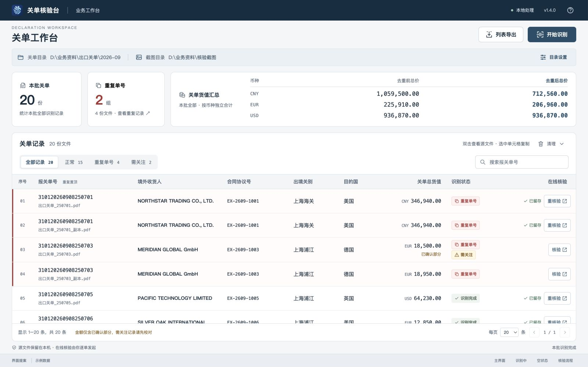

# 关单核验台 · 企业风界面提案与代码审查

基于当前 `main @ cc1ae62` / v1.4.0，2026-09-09。

## 先看效果

- [主界面](screenshots/01-workspace.png)
- [在线核验](screenshots/02-verification.png)
- [核验超时与手动截图](screenshots/03-verification-timeout.png)
- [清理二次确认](screenshots/04-cleanup.png)
- [识别进行中](screenshots/05-scanning.png)
- [空列表](screenshots/06-empty.png)
- [目录设置](screenshots/07-directories.png)
- [窄桌面布局](screenshots/08-narrow-desktop.png)

## 交互与开发交付

打开 [index.html](index.html) 可体验示例筛选、搜索、目录设置、识别/取消、核验与清理流程；底部可直接切换不同演示状态。原型不读取真实关单，不访问核验官网，不删除文件。全部资源在本地，无外部字体或 CDN 依赖。

- [设计规范与功能映射](DESIGN_SPEC.md)
- [代码审查：9 项问题与精简顺序](CODE_REVIEW.md)
- [验证记录](QA.md)
- [图标包](assets/icons/)：22 个 SVG，各含 24/32/48 px PNG
- [原浏览器监测脚本复现](tests/browser-monitor-repro.html)

这是设计与审查交付，生产 C# 源码未修改。Windows 原生 UI 落地、问题修复与 Windows 回归测试按报告中的顺序继续实施。
