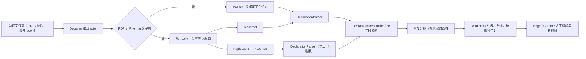

# 架构设计

## 总体流程

## 模块职责

- `BatchScanner`：限定格式和 200 文件边界、批量调度、重复分组、去重合计。
- `DocumentExtractor`：PDF 文字层抽取、页面渲染、图片 OCR 和双引擎执行。
- `DeclarationParser`：利用关单字段标签、表格列位置与业务格式提取六个字段。
- `DeclarationReconciler`：比较两个引擎的字段结果，执行安全补全或保守冲突标记。
- `StateStore`：将历史、浏览器偏好、分页大小和截图目录保存在 `%LocalAppData%\关单核验台`。
- `MainForm`：高 DPI 自适应布局、表格交互、筛选、分页和安全清理入口。
- `BrowserValidation` / `VerificationForm`：启动 Edge/Chrome、填写单号、等待人工验证并保存长截图。

## 便携运行

根目录启动器是一个轻量 Win32/.NET Framework 可执行文件，只负责调用 `runtime/dotnet.exe app/关单核验台.dll`。主程序、.NET Desktop Runtime、OCR 模型、Tesseract 与 PDFium 都包含在同一个解压目录中，因此不会依赖目标电脑的开发环境。

## 数据边界

- 输入只读取用户选定文件夹当前层。
- 运行数据只写入 `%LocalAppData%\关单核验台`、用户选定的截图目录和临时 OCR 目录。
- 临时渲染页处理结束后尝试清理；失败只记录日志，不影响关单结果。
- 在线核验由用户主动触发，且人工验证阶段保持在浏览器中完成。

