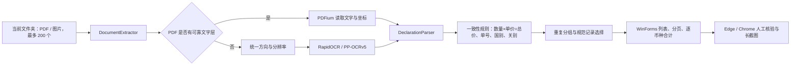

# 架构设计

## 总体流程

## 模块职责

- `ScanPlan` / `ScanSession`：文件预检、不可变清单、批次取消与已完成结果。
- `BatchScanner`：后台提取调度、逐条结果回报、重复分组、去重合计；可注入提取器进行核心回归。
- `DocumentExtractor` / `OcrImages`：PDF 文字层抽取、页面渲染、图片解码（含多页 TIFF、WEBP）、方向校正与 PP-OCRv5 识别。
- `DeclarationParser`：利用关单字段标签、表格列位置与业务格式提取六个字段，并对 OCR 结果执行一致性规则。
- `DeclarationReconciler`：比较两份识别结果的字段（v1.5.2 及以前的双引擎；v1.5.3 起不再产生第二份结果）。
- `StateStore`：将历史、分页大小和目录设置保存在 `%LocalAppData%\关单核验台`。
- `MainForm`：批次和界面事件；`MainForm.Layout`：布局和表格绘制。
- `Theme`、`UiControls`、`UiIcons`、`MetricCard`、`MoneySummaryPanel`：主题、基础控件、图标与汇总展示。
- `BrowserValidation` / `VerificationForm`：启动 Edge/Chrome、填写单号、等待人工验证并保存长截图；网页脚本作为 `BrowserScripts/*.js` 嵌入程序集，由浏览器回归页直接复用。

## 便携运行

根目录启动器是一个轻量 Win32/.NET Framework 可执行文件，只负责调用 `runtime/dotnet.exe app/关单核验台.dll`。主程序、.NET Desktop Runtime、PP-OCRv5 模型与 PDFium 都包含在同一个解压目录中，因此不会依赖目标电脑的开发环境。

## 数据边界

- 输入只读取用户选定文件夹当前层。
- 运行数据只写入 `%LocalAppData%\关单核验台`、用户选定的截图目录和临时 OCR 目录。
- 临时渲染页与 OCR 工作目录在成功、失败和取消时统一释放；失败只记录日志，不影响关单结果。
- 在线核验由用户主动触发，且人工验证阶段保持在浏览器中完成。

